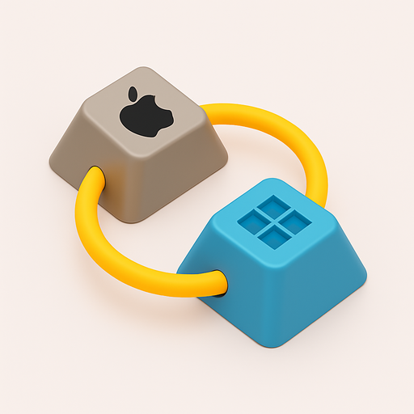

<p align="center">
  
</p>

# BoardKey

Universal keyboard shortcut translator. Press a shortcut on your keyboard, share the URL, and anyone can see it translated to their own keyboard layout and platform.

**Try it now: [made-by-chris.github.io/boardkey](https://made-by-chris.github.io/boardkey/)**

## Features

- **20+ keyboard layouts** — QWERTY, QWERTZ, AZERTY, Cyrillic, JIS, Dvorak, Colemak, and more
- **Cross-platform translation** — Mac (Cmd) ↔ Windows/Linux (Ctrl) modifier mapping
- **Character-aware translation** — Symbol keys like `+`, `-`, `[` translate by character intent, not just physical position
- **Mouse event capture** — Left/right/middle click and scroll wheel, combinable with modifier keys
- **20 application shortcut databases** — Chrome, VS Code, Photoshop, Figma, Slack, Excel, and more
- **Shareable URLs** — Every captured shortcut generates a link that auto-translates for the recipient
- **Real/Soft mode** — Real mode requires simultaneous key hold; Soft mode allows click-to-toggle
- **Dark/Light theme**
- **Zero dependencies** — Pure HTML, CSS, and ES modules. No build step.

## Usage

Serve the files with any static HTTP server:

```bash
npx serve
```

Then open `http://localhost:3000`.

### Capture a shortcut

Press any key combination on your physical keyboard, or click keys on the virtual keyboard (use Soft mode for click-to-toggle). Mouse events can be captured in the mouse area to the right of the keyboard.

### Share it

A URL is automatically generated in the share panel. Copy it and send it to anyone — when they open it, the shortcut is translated to match their keyboard layout and platform.

### Browse app shortcuts

Select an application from the dropdown to browse its keyboard shortcuts. Click any shortcut to highlight it on the virtual keyboard.

## Supported Layouts

| Layout | Region |
|--------|--------|
| US English (QWERTY) | US |
| UK English | UK |
| German (QWERTZ) | Germany |
| French (AZERTY) | France |
| Spanish | Spain |
| Italian | Italy |
| Portuguese (BR) | Brazil |
| Portuguese (PT) | Portugal |
| Dutch | Netherlands |
| Swedish | Sweden |
| Norwegian | Norway |
| Danish | Denmark |
| Finnish | Finland |
| Russian | Russia |
| Polish | Poland |
| Czech | Czech Republic |
| Japanese (JIS) | Japan |
| Korean | South Korea |
| Dvorak | US |
| Colemak | US |

## Supported Applications

Chrome, Firefox, VS Code, Sublime Text, IntelliJ IDEA, Word, Excel, PowerPoint, Photoshop, Premiere Pro, Figma, Blender, Slack, Discord, Notion, Spotify, Zoom, Outlook, Terminal, Finder/Explorer

- **Installable PWA** — Add to home screen on mobile or desktop via web app manifest

## Project Structure

```
boardkey/
├── index.html              # Single-page app shell
├── manifest.json           # PWA web app manifest
├── css/styles.css          # All styles, dark/light themes
├── js/
│   ├── app.js              # Main controller
│   ├── layouts.js          # 20+ keyboard layout data
│   ├── shortcuts.js        # App shortcut database
│   ├── mapping-engine.js   # Translation logic
│   ├── keyboard-renderer.js# Visual keyboard rendering
│   ├── detector.js         # Platform/layout auto-detection
│   └── sharing.js          # URL encode/decode
├── assets/
│   ├── favicon.ico         # Multi-size favicon (16/32/48)
│   ├── apple-touch-icon.png# 180×180 iOS icon
│   ├── icon-192.png        # PWA icon
│   ├── icon-512.png        # PWA icon (high-res)
│   └── og-image.png        # Open Graph social preview
└── package.json
```

## License

MIT
